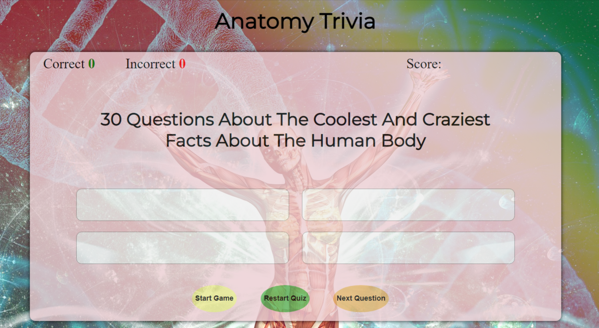

# Anatomy-Trivia

 View the live site [here!](https://perfecttennails.github.io/Anatomy-Trivia/game.html)

This puzzle is for all ages.
 30 Questions About The Coolest And Craziest Facts About The Human Body.

 

 ## Navigation

 ### There are 4 navigation buttons:
    - Start to begin the game 
    -Submit Answer to check the result of the question
    - Restart Game to start over from the begining
    - Next Question to hop over a question

## Fonts 
- fonts from google font
Montserrat, Work Sans, sans-serif
 

### Content
- The question array was taken from [Kidadl](https://kidadl.com/articles/anatomy-trivia-questions-about-the-gross-coolest-and-craziest-facts-about-the-human-body)

- The code for the function to reveal the correct answer was modified from https://www.geeksforgeeks.org/

### Media
- The background image was taken from [Pixa Bay](https://pixabay.com/)

### Testing

- I have tested that this website is responsive, looks good and works as intended on the different standard screen sizes, using the devtools device toolbar in Google Chrome.

- I have tested that this website works in different browsers: Chrome, Safari, Firefox, Microsot Edge.

- I have confirmed that the quiz is fully functional. The different buttons do what they're supposed to do and trigger their respective functions.

### Validator Testing
- HTML
    - No errors were found when passing through the official [W3C Validator](https://validator.w3.org/nu/)

- CSS
    - No errors were found when passing through the official [(Jigsaw) Validator](https://jigsaw.w3.org/css-validator/)

- JavaScript
    - No errors were found when passing through the [JSHint Validator](https://jshint.com/)

### Unfixed Bugs
i cannot get the score counter to work, that will be fixed in a new release.

## Deployment

- The site was deployed to GitHub pages. The steps to deploy are as follows:
    - In the GitHub repository, navigate to the Settings tab
    - Then navigate to Pages on the left from the Geneal section menu, select the Main Branch and save
    - Once the main branch has been selected, the page should be manually refreshed with a detailed ribbon display to indicate the successful deployment.